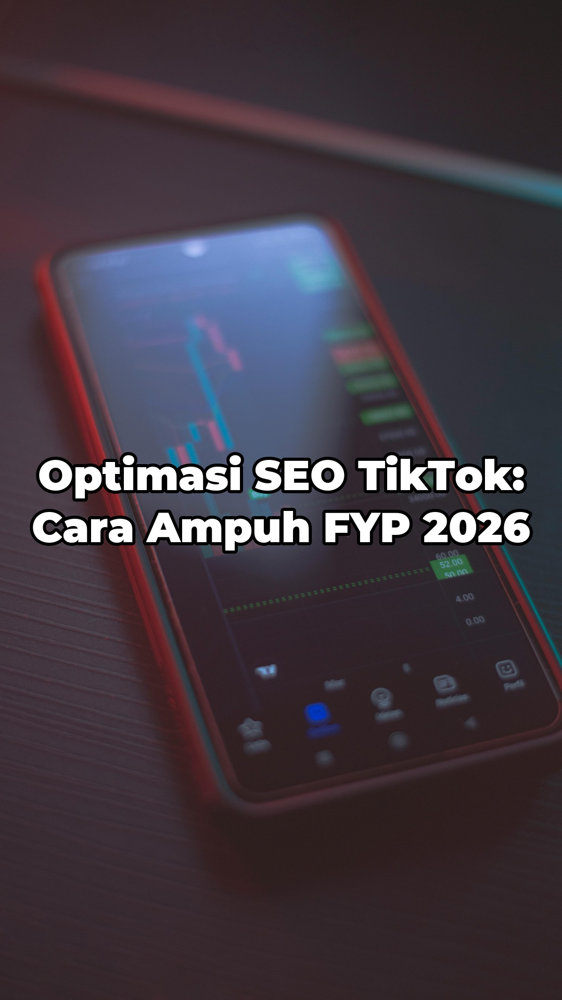
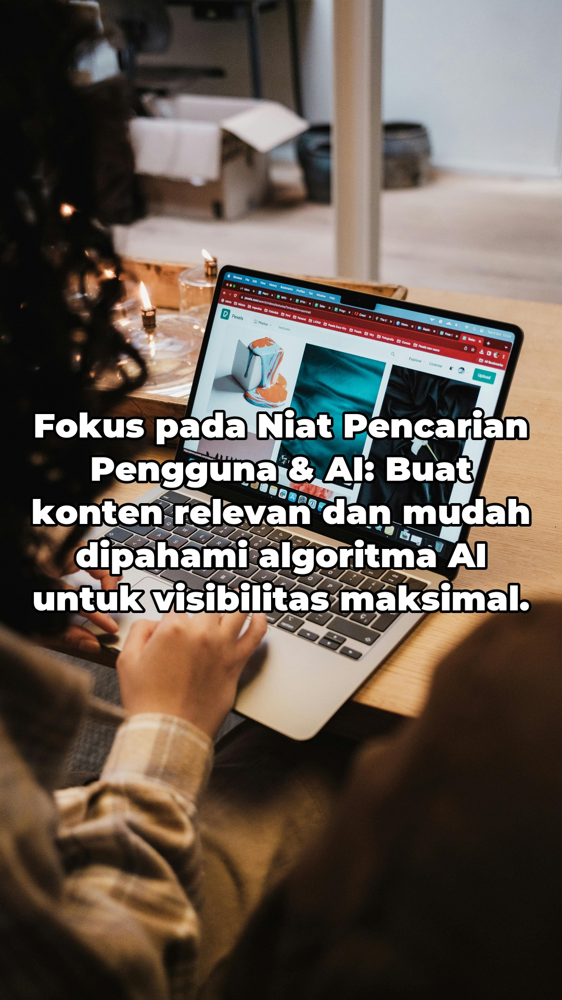
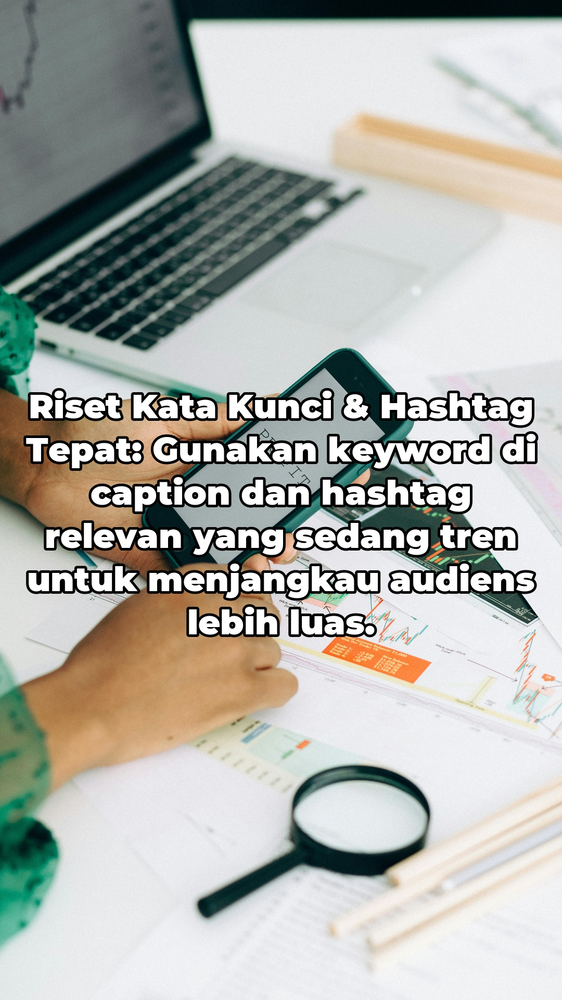
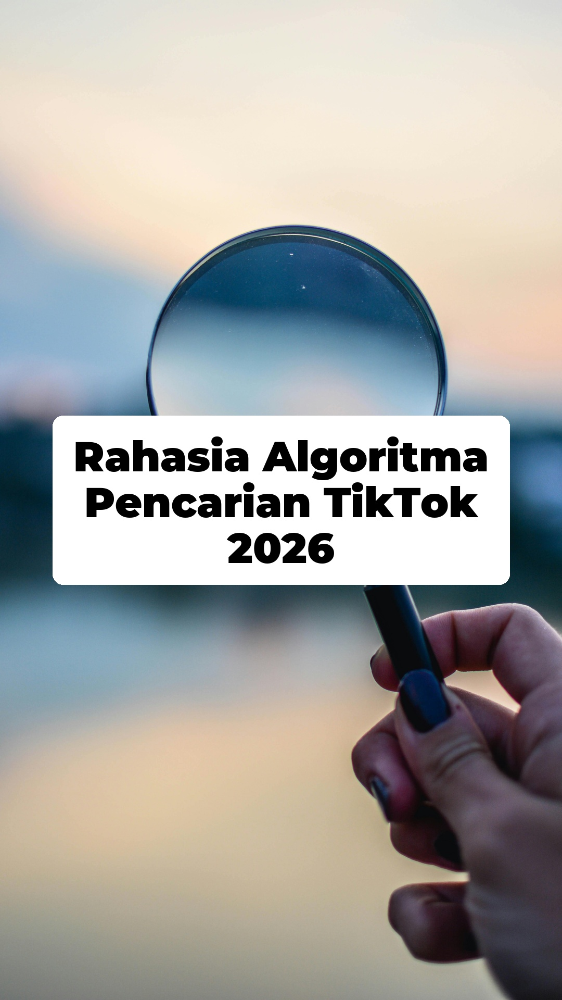
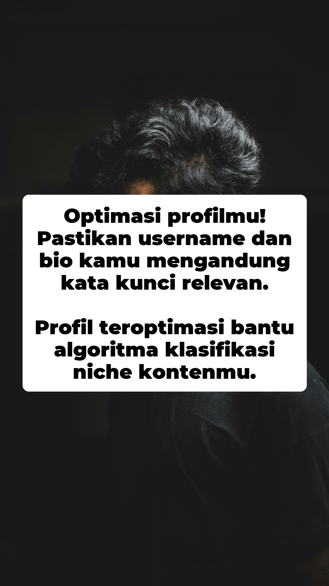
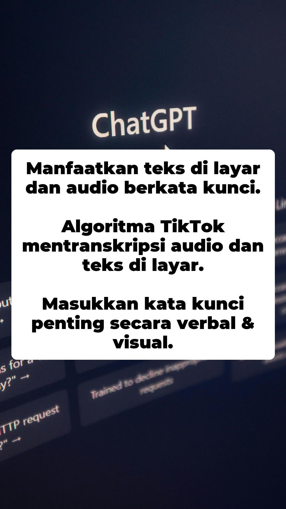
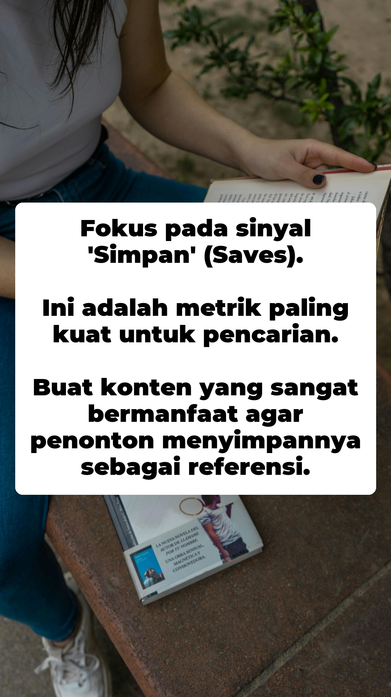
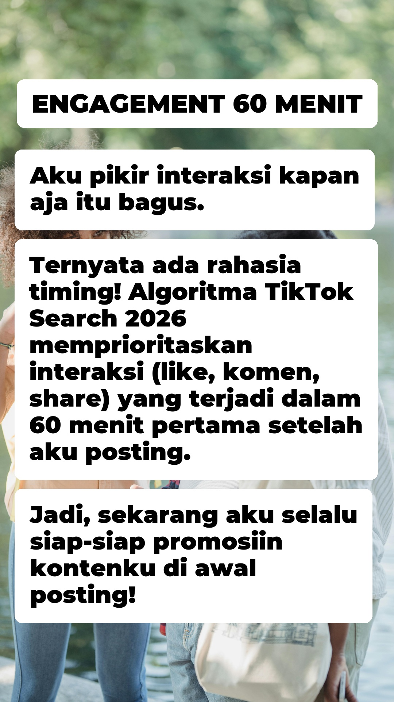
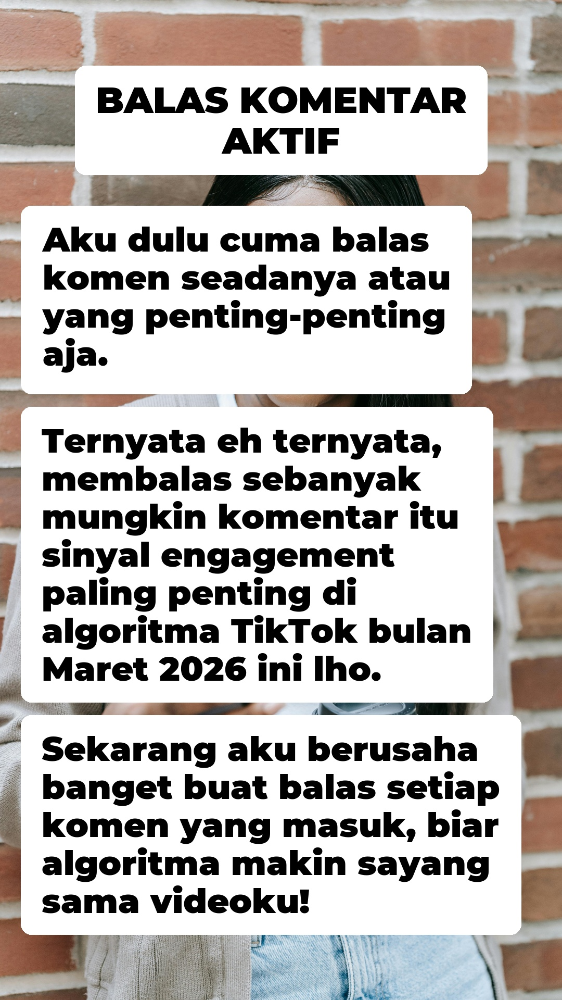

# 🚀 TikTok Carousel Image Generator (Auto-Content Creator)

> 🌐 **Language:** 🇮🇩 Bahasa Indonesia | [🇬🇧 English](README_EN.md)

Proyek *open-source* berbasis Python untuk mengotomatisasi pembuatan konten Karosel (Slideshow) TikTok, Instagram Reels, dan YouTube Shorts. 

Hanya dengan memberikan satu baris ide/topik, sistem ini akan melakukan riset internet, menulis naskah konten, mencari gambar *background* beresolusi tinggi, merender teks bergaya TikTok, dan menyiapkan metadata (Caption & Hashtag) siap *upload*.

## 🎯 Tujuan Proyek
Mempermudah *Content Creator* dan *Affiliate Marketer* dalam memproduksi konten edukasi atau tips bergaya *slideshow* secara masif, konsisten, dan berkualitas tinggi tanpa harus mendesain manual satu per satu.

## ✨ Fitur Utama
1. **🤖 AI Content Research & Copywriting:** Ditenagai oleh **Google Gemini AI** dengan fitur *Google Search Grounding*. Sistem mencari fakta dan tren paling *up-to-date* dari internet sebelum menulis teks slide.
2. **🖼️ Auto-Sourcing Background:** Integrasi **Pexels API** untuk otomatis mencari dan mengunduh gambar vertikal berkualitas tinggi. Dilengkapi dengan logika *Anti-Duplikat* agar gambar tidak berulang.
3. **🎨 Smart Image Processing (Pillow):** - Otomatis *crop* dan *resize* gambar ke rasio 9:16 (1080x1920).
   - Menambahkan *overlay* teks presisi di tengah layar.
   - **Auto-shrink Text:** Ukuran font akan otomatis mengecil jika teks terlalu panjang agar tidak keluar batas layar.
4. **💅 Tiga Gaya Visual Teks TikTok:**
   - `outline`: Teks putih tebal dengan garis luar (*stroke*) hitam pekat (Gaya klasik TikTok).
   - `box`: Teks putih di dalam kotak transparan bersudut melengkung (*Rounded Rectangle*).
   - `box-title-content`: Teks bergaya cerita (personal) dengan judul *uppercase* di kotak terpisah pada posisi atas, serta isi tulisan yang dipecah per baris menjadi kotak-kotak melayang.
5. **🧠 Smart Context Memory (Multi-part Series):** Otomatis menyimpan histori *generate* ke dalam `context.txt`. Jika kamu membuat "Part 2", AI akan membaca file ini dan **tidak akan mengulangi** poin yang sama dari "Part 1".
6. **📦 Auto-Metadata Generation:** Menghasilkan file `metadata.json` yang berisi Judul Catchy, Deskripsi/Caption, dan Hashtag yang siap di-*copy-paste* saat *upload*.
7. **🅰️ Auto-Download Font:** Tidak punya font *bold*? Sistem akan otomatis mengunduh font **Montserrat-Black** jika file font tidak ditemukan di komputermu.

---

## 🛠️ Persiapan & Instalasi

**1. Clone Repositori & Masuk ke Folder**
```bash
git clone https://github.com/NaufalRizqullah/tiktok-carousel-generator
cd tiktok-carousel-generator
```

**2. Install Dependencies**
Kamu bisa menggunakan `pip` atau `uv` (direkomendasikan karena lebih cepat).
```bash
# Jika pakai uv
uv venv
uv pip install -r requirements.txt

# Jika pakai pip biasa
pip install -r requirements.txt
```

**3. Setup API Keys (.env)**
Buat file bernama `.env` di *root folder* proyek, lalu masukkan API Key milikmu:
```env
PEXELS_API_KEY=masukkan_api_key_pexels_di_sini
GOOGLE_API_KEY=masukkan_api_key_gemini_di_sini
```
*(Dapatkan key gratis di [Pexels API](https://www.pexels.com/api/) dan [Google AI Studio](https://aistudio.google.com/))*

---

## 🚀 Cara Penggunaan

Jalankan script `main.py` dari terminal/command prompt.

**Contoh 1: Basic Run (Gaya Outline)**
```bash
python main.py -t "Tips Diet Pemula"
```
*(Otomatis membuat 6 gambar: 1 Judul + 5 Konten di folder `output`)*

**Contoh 2: Custom Parameter (Gaya Box, 7 Slide, Folder Custom)**
```bash
python main.py -t "Cara Optimasi SEO 2026" -s 7 --style box -o "konten_seo"
```

**Contoh 3: Membuat Konten Berseri (Part 1 & Part 2)**
Berkat fitur *Context Memory*, kamu bisa membuat serial konten tanpa takut materinya berulang:
```bash
# Eksekusi pertama
python main.py -t "Ide Usaha Modal Kecil part 1" -o "usaha_p1"

# Eksekusi kedua (AI akan membaca context.txt dan memberikan ide BARU)
python main.py -t "Ide Usaha Modal Kecil part 2" -o "usaha_p2"
```
> ⚠️ **PENTING:** Jika kamu ingin berganti ke topik yang **benar-benar berbeda** (misal dari "Ide Usaha" ke "Resep Masakan"), pastikan kamu **MENGHAPUS** file `context.txt` terlebih dahulu agar AI tidak bingung!

---

## ⚙️ Parameter CLI (Arguments)

| Argumen Singkat | Argumen Lengkap | Deskripsi | Default |
| :--- | :--- | :--- | :--- |
| `-t` | `--topic` | **(Wajib)** Topik pembahasan untuk di-generate AI | *None* |
| `-s` | `--slides` | Jumlah slide konten (tidak termasuk slide judul) | `5` |
| `--style` | `--style` | Gaya visual teks (`outline`, `box`, atau `box-title-content`) | `outline` |
| `--title-family`| `--title-family`| Family font judul (contoh: `LeagueSpartan` atau `Poppins`) | *dari config* |
| `--title-weight`| `--title-weight`| Ketebalan font judul (angka `100` - `900`) | *dari config* |
| `--content-family`| `--content-family`| Family font konten (contoh: `LeagueSpartan` atau `Poppins`) | *dari config* |
| `--content-weight`| `--content-weight`| Ketebalan font konten (angka `100` - `900`) | *dari config* |
| `-o` | `--output` | Nama folder tempat hasil gambar dan metadata disimpan | `output` |

---

## 📁 Struktur Output

Setelah script selesai berjalan, folder output pilihanmu (default: `output/`) akan berisi:

```text
output/
├── slide_00.jpg        # Slide Cover/Judul Utama
├── slide_01.jpg        # Slide Konten Poin 1
├── slide_02.jpg        # Slide Konten Poin 2
├── ...
└── metadata.json       # Berisi Judul TikTok, Caption, dan Hashtag
```

Selain itu, di *root folder* akan muncul/terupdate file `context.txt` yang menyimpan histori poin-poin yang sudah dibahas.

---

## 📂 Struktur Proyek

Proyek ini menggunakan arsitektur modular. Semua logika inti dipisah ke dalam *package* `tiktok_carousel/` agar mudah di-*maintain*, di-*extend*, dan di-*test*.

```text
tiktok-image-gen/
├── main.py                          # Entry point CLI (argparse + load .env)
├── tiktok_carousel/                 # Package utama
│   ├── __init__.py                  # Re-export TikTokCarouselGenerator
│   ├── config.py                    # Semua konstanta konfigurasi (canvas, font, warna, dll)
│   ├── utils.py                     # Utilitas: download font, context memory, sanitize teks
│   ├── content.py                   # Modul AI Content Generator (Google Gemini)
│   ├── image_source.py              # Modul Image Sourcing (Pexels API)
│   ├── renderer.py                  # Modul Image Processing & Text Rendering (Pillow)
│   └── generator.py                 # Orchestrator: menggabungkan semua modul jadi pipeline
├── .env                             # API Keys (tidak di-commit)
├── .env.example                     # Contoh format .env
├── context.txt                      # Auto-generated: memori konteks antar Part
├── font.ttf                         # File font (auto-download jika belum ada)
├── output/                          # Folder hasil gambar & metadata
├── pyproject.toml                   # Konfigurasi project Python
├── requirements.txt                 # Daftar dependensi
└── README.md
```

### Penjelasan Tiap Modul

| Modul | Deskripsi |
| :--- | :--- |
| `config.py` | Berisi semua variabel konfigurasi global (ukuran canvas, font, warna box/outline, margin, kualitas JPG, dll). Ubah file ini untuk *tweak* tampilan tanpa menyentuh logika. |
| `utils.py` | Fungsi utilitas murni: auto-download font Montserrat-Black, baca/tulis file `context.txt` untuk fitur *memory*, dan sanitasi teks (hapus emoji/non-BMP). |
| `content.py` | Class `ContentGenerator` — menangani komunikasi dengan Google Gemini AI, termasuk *prompt engineering*, *retry logic* dengan *exponential backoff*, dan parsing JSON respons. |
| `image_source.py` | Class `PexelsImageSource` — mencari & mengunduh gambar *portrait* dari Pexels API, dilengkapi logika *anti-duplikat* agar gambar tidak berulang. |
| `renderer.py` | Class `SlideRenderer` — memproses gambar (*resize/crop* ke 9:16), merender teks dengan berbagai gaya (`outline`, `box`, `box-title-content`), termasuk *auto-shrink* dan *text wrapping*. |
| `generator.py` | Class `TikTokCarouselGenerator` — *Orchestrator* yang menyatukan semua modul menjadi satu *pipeline*: generate konten → cari gambar → render slide → simpan file. |

---

## 🛠️ Konfigurasi Lanjutan (Tweak Moding)

Sistem ini didesain agar sangat fleksibel. Kamu bisa mengubah tata letak, warna, ukuran, hingga *behavior* AI hanya dengan mengubah nilai variabel di file `tiktok_carousel/config.py`.

Berikut adalah daftar lengkap variabel yang bisa kamu kustomisasi:

### ⚙️ Pengaturan AI & Sistem
| Variabel | Deskripsi | Default |
| :--- | :--- | :--- |
| `CONTEXT_FILE` | Nama file teks untuk menyimpan memori/konteks agar AI tidak mengulang poin di *Part* selanjutnya. | `"context.txt"` |
| `POINTS_ONLY_TEXT` | Jika `True`, memaksa AI hanya menulis poin singkat (bukan paragraf). | `True` |
| `MAX_WORDS_PER_SLIDE`| Batas maksimal jumlah kata yang boleh di-generate AI per slide konten. | `30` |

### 📐 Pengaturan Canvas & Margin
| Variabel | Deskripsi | Default |
| :--- | :--- | :--- |
| `CANVAS_WIDTH` | Lebar resolusi gambar output (pixel). | `1080` |
| `CANVAS_HEIGHT` | Tinggi resolusi gambar output (pixel). | `1920` |
| `SAFE_TOP_BOTTOM_MARGIN`| Area aman vertikal agar teks tidak tertutup UI TikTok (nama akun, caption, tombol *like*). | `180` |
| `TEXT_SIDE_MARGIN` | Jarak aman teks dari tepi kiri dan kanan layar. | `80` |
| `TEXT_VERTICAL_OFFSET`| Geser posisi teks seluruhnya secara vertikal. `0` = pas di tengah layar. | `0` |

### 🔠 Pengaturan Tipografi (Font)
| Variabel | Deskripsi | Default |
| :--- | :--- | :--- |
| `TITLE_FONT_FAMILY`| Nama folder/family font untuk Slide Judul. | `"LeagueSpartan"` |
| `TITLE_FONT_WEIGHT`| Ketebalan font judul (100=Thin... 400=Regular... 900=Black). | `700` |
| `CONTENT_FONT_FAMILY`| Nama folder/family font untuk Slide Konten. | `"Poppins"` |
| `CONTENT_FONT_WEIGHT`| Ketebalan font konten (100=Thin... 400=Regular... 900=Black). | `400` |
| `TITLE_FONT_SIZE` | Ukuran font utama untuk Slide Judul/Cover. | `85` |
| `CONTENT_FONT_SIZE` | Ukuran font utama untuk Slide Konten. | `68` |
| `TEXT_LINE_SPACING` | Jarak spasi antar baris teks (*line height*). | `10` |
| `AUTO_SHRINK_TEXT` | Jika `True`, ukuran font otomatis mengecil jika teks AI terlalu panjang dan melewati batas aman. | `False` |
| `AUTO_SHRINK_MIN_FONT_SIZE`| Batas ukuran font terkecil saat mode *auto-shrink* aktif. | `42` |
| `AUTO_SHRINK_STEP` | Jumlah pengurangan ukuran font setiap kali iterasi pengecilan. | `2` |

### 🎨 Gaya Visual: Box (Kotak Teks)
| Variabel | Deskripsi | Default |
| :--- | :--- | :--- |
| `BOX_PADDING_X` | Jarak spasi horizontal antara teks dengan tepi dalam kotak. | `55` |
| `BOX_PADDING_Y` | Jarak spasi vertikal antara teks dengan tepi dalam kotak. | `35` |
| `BOX_RADIUS` | Tingkat kelengkungan sudut kotak (*rounded rectangle*). | `28` |
| `BOX_FILL` | Warna latar kotak dalam format `(R, G, B, Opacity)`. Default adalah putih semi-transparan. | `(255, 255, 255, 235)` |
| `BOX_TEXT_FILL` | Warna teks di dalam kotak. Default adalah hitam. | `(0, 0, 0)` |

### 🖌️ Gaya Visual: Outline (Garis Luar)
| Variabel | Deskripsi | Default |
| :--- | :--- | :--- |
| `OUTLINE_TEXT_FILL` | Warna utama teks. | `"white"` |
| `OUTLINE_STROKE_FILL`| Warna garis tepi (*stroke/outline*). | `"black"` |
| `OUTLINE_STROKE_RATIO`| Rasio ketebalan garis tepi terhadap ukuran font (misal: `0.08` x font `85`). | `0.08` |

### 💾 Pengaturan Output
| Variabel | Deskripsi | Default |
| :--- | :--- | :--- |
| `JPG_QUALITY` | Kualitas kompresi gambar JPG yang disimpan (skala 1-100). | `95` |

---

## 📸 Contoh Hasil

Berikut adalah contoh gambar yang dihasilkan oleh sistem ini untuk setiap gaya visual:

### 🖌️ Style: `outline`

| Slide 00 | Slide 01 |
| :---: | :---: |
|  |  |
| **Slide 02** | **Slide 03** |
|  |  |

### 📦 Style: `box`

| Slide 00 | Slide 01 |
| :---: | :---: |
|  |  |
| **Slide 02** | **Slide 03** |
|  |  |

### 📝 Style: `box-title-content`

| Slide 00 | Slide 01 |
| :---: | :---: |
|  |  |
| **Slide 02** | **Slide 03** |
|  |  |